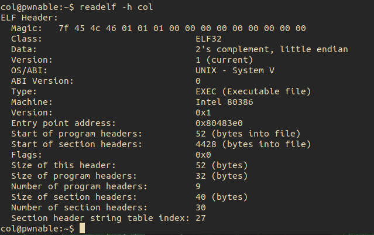

## collision

Upon connecting we see the following files:


The col.c file gives us

```
#include <stdio.h>
#include <string.h>
unsigned long hashcode = 0x21DD09EC;
unsigned long check_password(const char* p){
	int* ip = (int*)p;
	int i;
	int res=0;
	for(i=0; i<5; i++){
		res += ip[i];
	}
	return res;
}

int main(int argc, char* argv[]){
	if(argc<2){
		printf("usage : %s [passcode]\n", argv[0]);
		return 0;
	}
	if(strlen(argv[1]) != 20){
		printf("passcode length should be 20 bytes\n");
		return 0;
	}

	if(hashcode == check_password( argv[1] )){
		system("/bin/cat flag");
		return 0;
	}
	else
		printf("wrong passcode.\n");
	return 0;
}
```
In the main function we can see that we have to do two things:
1. Pass the program an argument that is 20 bytes in length
2. Make the argument such that the value returned by the check_password function equals the hashcode 0x21DD09EC

### check_password
```
unsigned long check_password(const char* p){
	int* ip = (int*)p;
	int i;
	int res=0;
	for(i=0; i<5; i++){
		res += ip[i];
	}
	return res;
}
```
The function casts our argument as a pointer to an integer. Next it adds the contents of ip in 4 byte arguments to the variable res by incrementing the pointer. We can confirm this by running readelf on the binary to see that this is a 32-bit binary, meaning that the size of a pointer is 4 bytes.



res is then returned.

### Matching the Hashcode
Looking back at the main function, in order for us to get the flag we will need to have the return value of the check_password function match our hashcode of 0x21dd09ec. There are many ways to do this, ones first though might be to divide the hashcode by 5 since our loop adds 5, 4 byte chunks to res. However there is an issue.

0x21dd09ec = 0x6c5cec8 * 5 + 0x4

Since our loop only runs 5 times we will be 0x4 short. Let's try multiplying 0x6c5cec8 by 4 and add the remainder for our fifth number.

0x21dd09ec = 0x6c5cec8 * 4 + 0x6c5cecc

### Bringing It All Together
Using Python we can pass this to our binary, but we need to be careful. From the readelf we can see that this uses [little endian](https://en.wikipedia.org/wiki/Endianness) meaning we need to pass our values accordingly as seen below.

```
col@pwnable:~$ ./col "`python -c "print '\xc8\xce\xc5\x06'*4+'\xcc\xce\xc5\x06'"`"
```
Giving us our flag

```
daddy! I just managed to create a hash collision :)
```
