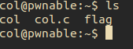

## collision

Upon connecting we see the following files:



The col.c file gives us

```
#include <stdio.h>
#include <string.h>
unsigned long hashcode = 0x21DD09EC;
unsigned long check_password(const char* p){
	int* ip = (int*)p;
	int i;
	int res=0;
	for(i=0; i<5; i++){
		res += ip[i];
	}
	return res;
}

int main(int argc, char* argv[]){
	if(argc<2){
		printf("usage : %s [passcode]\n", argv[0]);
		return 0;
	}
	if(strlen(argv[1]) != 20){
		printf("passcode length should be 20 bytes\n");
		return 0;
	}

	if(hashcode == check_password( argv[1] )){
		system("/bin/cat flag");
		return 0;
	}
	else
		printf("wrong passcode.\n");
	return 0;
}
```
In the main function we can see that we have to do two things:
1. Pass the program an argument that is 20 characters in length
2. Make the argument such that the value returned by the check_password function equals the hashcode 0x21DD09EC

### check_password function
```
unsigned long check_password(const char* p){
	int* ip = (int*)p;
	int i;
	int res=0;
	for(i=0; i<5; i++){
		res += ip[i];
	}
	return res;
}
```
The function casts our argument to 
